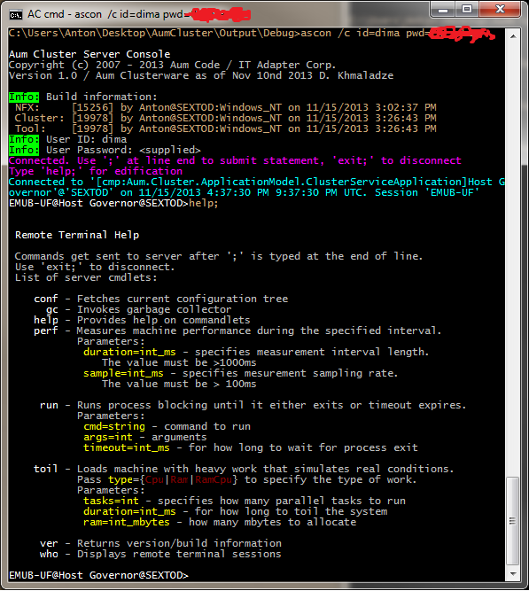
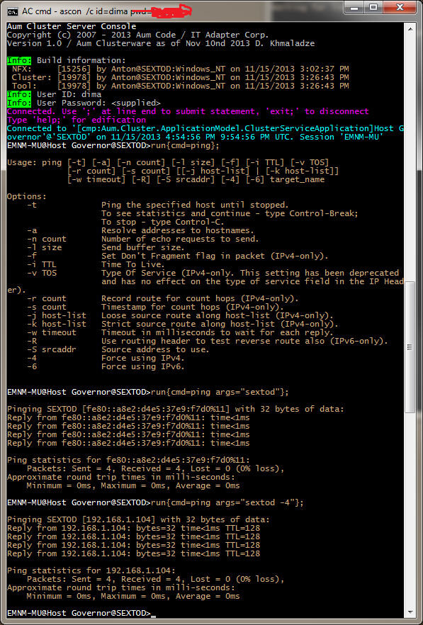
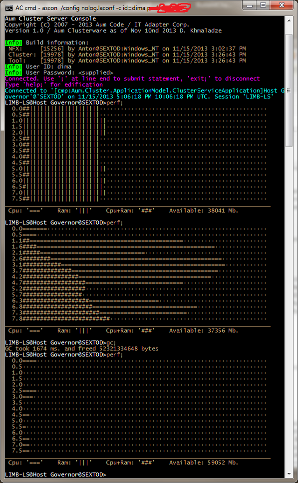

# Aum Cluster - Application Remote Terminals

## What is it?
Aum Clusterware supports a concept of **application remote terminals**. They behave much like a regular command prompt, however the commands are application level - they operate not on OS objects but rather on application objects. Here is a typical command: "gc" - it performs a garbage collection inside your server process.

The way it works is really simple - take a look at the following contract:
```cs
/// <summary>
/// Represents a contract for working with remote entities using terminal/command approach
/// </summary>
[Glued]
[AuthenticationSupport]
[RemoteTerminalOperatorPermission]
[LifeCycle(ServerInstanceMode.Stateful, SysConsts.REMOTE_TERMINAL_TIMEOUT_MS)]
public interface IRemoteTerminal
{
  [Constructor]
  RemoteTerminalInfo Connect(string who);

  string Execute(string command);

  [Destructor]
  string Disconnect();
}
```
This is a typical NFX.Glue stateful entity that serves remote console sessions, it is hosted on the server that you want to login into, and gets activated by NFX.Glue runtime. All we need to do is add the following lines to our configuration file on the host process:
```
glue
{
  servers
  {
    server {name="TerminalAsync"
            node="async://*:7700"
            contract-servers="ahgov.HGovRemoteTerminal, ahgov"}
  }
}
```
This exposes HGovRemoteTerminal class as a server using "async" binding on all network interfaces on tcp port 7700. This class is the one that implements the aforementioned IRemoteTerminal contract. Now we can consume the service remotely!

## How do I work with/manage my remote application?
Since our app remote terminal architecture relies on NFX.Glue, we can simply connect to remote terminal using Aum.Cluster.Clients.RemoteTerminal class, which resides in Aum.Cluster.dll assembly, but why would you want to do this? The whole point of this approach is **to be able to work with application containers remotely without any coding** - that is what people use command prompts for or maybe even graphical management tools that send commands on the background.

So we have created a tool - "ascon" which stands for "aum server console". Here is a nice screenshot:  


The app runs in verbose or silent modes, here I have typed-in a "help" command:  


You can also specify command text right from orignal command-line and also use "silent" switch to suppress all logos and info messages. In this example we get an information for the remote server build set: dates, computer names and who built the software that runs on the server:  


## Command-Lets
We chose a flexible approach to creating server handlers that understand those little commands that you enter via the ASCON tool. We use reflection to dynamically discover Cmdlet class implementers and that is how commands get dispatched and provide help. Let's look at a VER commandlet:
```cs
public class Ver : Cmdlet
{
  public Ver(AppRemoteTerminal terminal, IConfigSectionNode args) :
    base(terminal, args) {}
  
  public override string Execute()
  {
    var result = new StringBuilder(0xff);
    result.AppendLine("Server Version/Build information:");
    result.AppendLine(" App:     " + App.Name);
    result.AppendLine(" NFX:     " + BuildInformation.ForFramework);
    result.AppendLine(" Cluster: " + new BuildInformation( typeof(Aum.Cluster.Clusterware).Assembly ));
    result.AppendLine(" Host:    " + new BuildInformation( Assembly.GetEntryAssembly() ));

    return result.ToString();
  }

  public override string GetHelp()
  {
    return "Returns version/build information";
  }
}
```
Enough said! You've got the idea!

## Remote Management - IO Redirection
Here is another nice commandlet "run". I want to ping my host "SEXTOD" from my server, notice how I forgot to specify the args and "PING" responded with help into our server process which redirected IO into this ASCON session using NFX.Glue:  


## Remote Management - Load Testing and Performance
If you are not convinced that this is cool, here are a few more commands for you: "toil" and "perf".

"TOIL" - is used to load server with garbage work, you can specify options - whether you want CPU only, or RAM only, or both. Take a look:  


And here is the result on the server computer:  


This is really usable for load testing to stress the poor server out until it cries for medical help! But wait! I am not at the server! How can I see my CPU and RAM spikes? Not to worry about things like physical locality (since we are not fully enlightened beings yet and must crawl in those damn bodies of ours that depend on stupid physics!), we have included another interesting command-let "PERF":  


I was "toiling" the server from another console session, RAM graph got really high, then I ran "GC" and RAM went down!

## Conclusion
What is remote application console - it is a simple feature that one can not expect to build a reliable cluster-enabled system without, where there are 1000s of machines. Yes, there is SSH and other gooddies, but they are NOT APPLICATION level, they are OS level - and that is **where we hugely differ from the rest in our approach**, our whole framework is cloud-aware, so our services like application containers and other components are built for the cloud from day one. Remote Application Console is a living testimony to this.

---
Dmitriy Khmaladze  
November 15, 2013