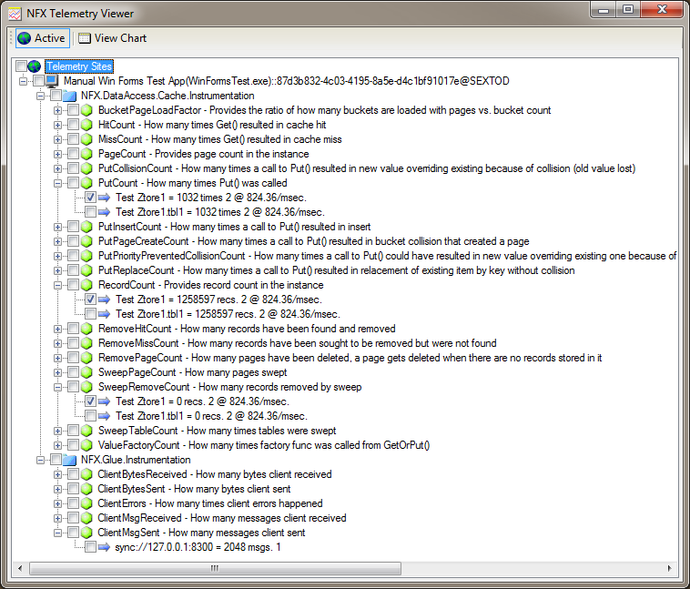
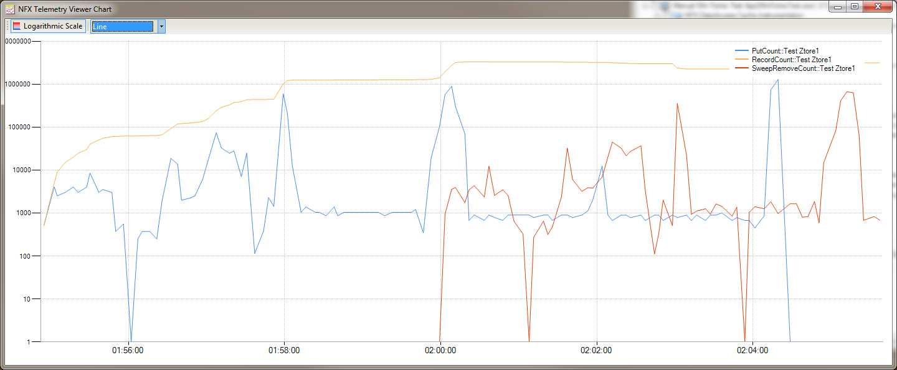
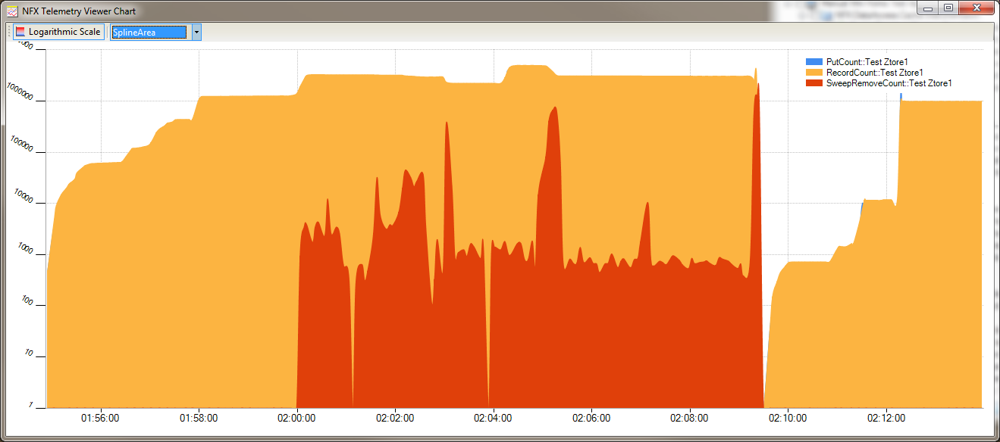
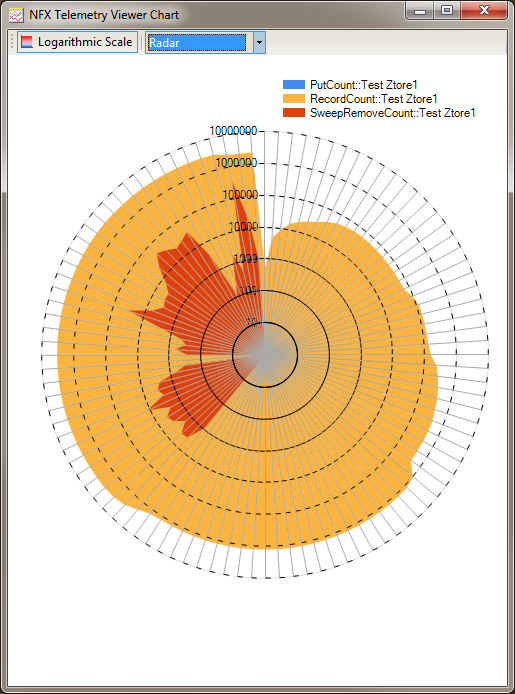
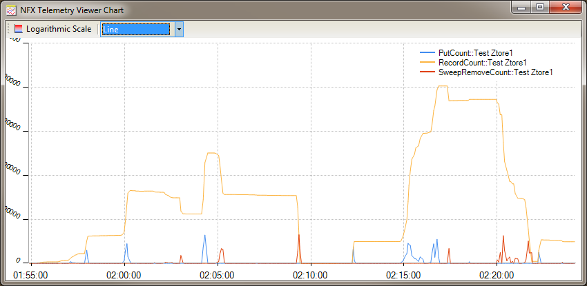
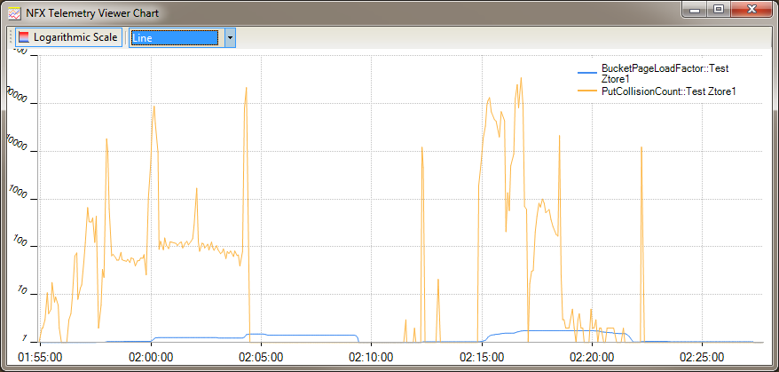
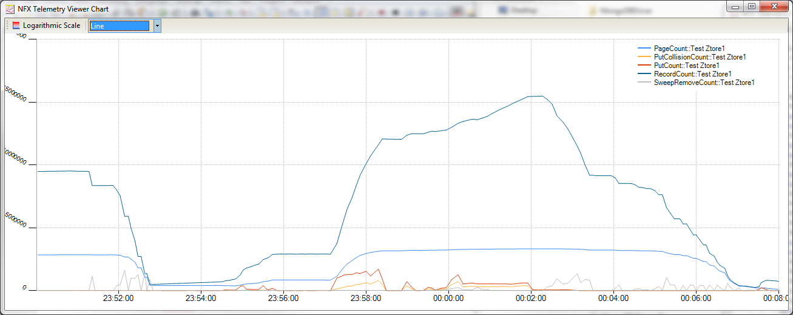

# NFX Instrumentation and Telemetry

## NFX.Instrumentation Overview
Instrumentation is an ability to insert various level and event counters that allow for detailed runtime monitoring of the instrumented software. In Windows paradigm there is a concept of "PerformanceCounter" which is similar to the one in NFX, however Windows performance counters are OS-specific and do not scale well in hierarchical server clusters. NFX, on the other hand, provides 100% native code cluster-enabled (can run in large server farms) platform-independent concept, i.e. JFX will support the same concept for applications written in JAVA.

Instrumentation is a built-in function in the NFX library. It is a service of IApplication, so any application that runs inside of NFX application container has the luxury of being instrumented. It all comes down to the single method called "Record":
```cs
/// <summary>
/// Stipulates instrumentation contract
/// </summary>
public interface IInstrumentation : ILocalizedTimeProvider 
{
  /// <summary>
  /// Indicates whether instrumentation is enabled
  /// </summary>
  bool Enabled { get;}
   
  /// <summary>
  /// Records instrumentation datum
  /// </summary>
  void Record(Datum datum);
}
```
Instrumentation is built around the Datum class that provides general abstraction for two direct sub-types: Events and Gauges. Every Datum instance has a start/stop timestamps and Count property that says how many times a measurement has been taken / event occurred.
```cs
/// <summary>
/// Base class for single measurement events (datums) reported to instrumentation
/// </summary>
public abstract class Datum
{
  /// <summary>
  /// Returns UTC time stamp when event happened
  /// </summary>
  public DateTime UTCTime
  /// <summary>
  /// Returns UTC time stamp when event happened.
  /// This property may be gotten only if IsAggregated==true, otherwise UTCTime value is returned
  /// </summary>
  public DateTime UTCEndTime
  /// <summary>
  /// Indicates whether this instance represents a roll-up/aggregation of multiple events
  /// </summary>
  public bool IsAggregated
  /// <summary>
  /// Returns count of measurements.
  /// This property may be gotten only if IsAggregated==true, otherwise zero is returned
  /// </summary>
  public int Count
  /// <summary>
  /// Returns datum source. Data are rolled-up by type of recorded datum instances and source
  /// </summary>
  public string Source
  /// <summary>
  /// Returns rate of occurrence string
  /// </summary>
  public string Rate
  /// <summary>
  /// Returns description for data that this datum represents.
  /// Base implementation returns full type name of this instance
  /// </summary>
  public virtual string Description
  /// <summary>
  /// Provides access to value polymorphically
  /// </summary>
  public abstract object ValueAsObject { get;}
  /// <summary>
  /// Provides name for units that value is measured in
  /// </summary>
  public abstract string ValueUnitName { get; }
}
```
Every instance of Datum class represents either a single event/measurement or an aggregation of multiple measurements/events. The instrumentation framework gathers reported data and "reduces" it by keys into summary/aggregation objects once every X seconds. The aggregated data then gets written into NFX.Instrumentation.Provider-implementing class.

Every instance of Datum class represents either a single event/measurement or an aggregation of multiple measurements/events. The instrumentation framework gathers reported data and "reduces" it by keys into summary/aggregation objects once every X seconds. The aggregated data then gets written into NFX.Instrumentation.Provider-implementing class.

In contrast to events, a Gauge is a level/meter that signifies an event of measurement of some volatile value and captures the measurement value in it's Value property (pardon the tautology). Actually, there are LongGauge and DoubleGauge general ancestors for integer and real arithmetic. Just like an event, an instance of Gauge also has a Count property that says how many times a measurement has been performed.

The object model is a classic OOP. You can design your own Datum-derivatives and capture whatever data you want, i.e. you can capture complex values like lists or arrays (or real complex numbers).

Here is an example of a self-explanatory event:
```cs
[Serializable]
public class ServerGotOverMaxMsgSizeErrorEvent : ServerTransportErrorEvent
{
  protected ServerGotOverMaxMsgSizeErrorEvent(string src) : base(src) {}
    
  public static void Happened(Node node)
  {
    var inst = App.Instrumentation;
    if (inst.Enabled)
      inst.Record(new ServerGotOverMaxMsgSizeErrorEvent(node.ToString())); 
  }
    
  public override string Description
  {
    get { return "Server-side errors getting messages with sizes over limit"; }
  }

  protected override Datum MakeAggregateInstance()
  {
    return new ServerGotOverMaxMsgSizeErrorEvent(this.Source); 
  }
}
```
And here is how it is used in Glue TCP server transport:
```cs
var size = msb.ReadBEInt32();
if (size>Binding.MaxMsgSize)
{
  Instrumentation.ServerGotOverMaxMsgSizeErrorEvent.Happened(Node);

  // This is unrecoverable error - close the channel!
  throw new MessageSizeException(size, Binding.MaxMsgSize, "getRequest()", closeChannel: true);
}
```
Here is an example of a self-explanatory gauge:
```cs
[Serializable]
public class ServerBytesReceived : ServerGauge, INetInstrument
{
  protected ServerBytesReceived(string src, long value) : base(src, value) {}

  public static void Record(Node node, long value)
  {
    var inst = App.Instrumentation;
    if (inst.Enabled)
      inst.Record(new ServerBytesReceived(node.ToString(), value)); 
  }
 
 
  public override string Description { get{ return "How many bytes server received"; }}
  public override string ValueUnitName { get{ return "bytes"; }}


  protected override Datum MakeAggregateInstance()
  {
    return new ServerBytesReceived(this.Source, 0); 
  }
}
```
And here is how it is used in one place that dumps TCP transport statistics on the Glue server:
```cs
if (m_InstrumentServerTransportStat)
{
  Instrumentation.ServerBytesReceived.Record(node, transport.StatBytesReceived);
  Instrumentation.ServerBytesSent.Record(node, transport.StatBytesSent);
  Instrumentation.ServerMsgReceived.Record(node, transport.StatMsgReceived);
  Instrumentation.ServerMsgSent.Record(node, transport.StatMsgSent);
  Instrumentation.ServerErrors.Record(node, transport.StatErrors);
}
```

## Working with Instrumentation Data
NFX.Instrumentation outputs data via NFX.Instrumentation.InstrumentationProvider. Currently we have two implementing classes: LogInstrumentationProvider and TelemetryInstrumentationProvider. The second one does everything the first one does plus it sends data over network into ITelemetryReceiver endpoint:
```cs
/// <summary>
/// Represents a contract for working with remote receiver of telemetry information
/// </summary>
[Glued]
[LifeCycle(Mode = ServerInstanceMode.Singleton)]
public interface ITelemetryReceiver
{
  /// <summary>
  /// Sends data to remote telemetry receiver
  /// </summary>
  /// <param name="siteName">the name/identifier of the reporting site
  /// <param name="data">Telemetry data
  [OneWay] void Send(string siteName, Datum data);
}
```
There is a tool called "TelemetryViewer" that implements the aforementioned interface. If you want to get your app instrumented, just add these lines to your config:
```css
instrumentation
 { 
   name="Instruments"
   interval-ms="5000"
    
   provider
   {
     name="Telemetry Instrumentation Provider"
     type="NFX.Instrumentation.Telemetry.TelemetryInstrumentationProvider"
     use-log="true"
     receiver-node="sync://devsrv2:8300"
   }
 }
 ```
This will instruct NFX.Instrumentation to aggregate all data every 5 seconds and write it to local log and remote telemetry endpoint.

Now, it is time to run the TelemetryViewer tool. If you have your instrumented app running then you will see it's events and gauges in a matter of seconds:  


Here is how NFX.DataAccess.Cache output looks:  


This shows how sweeper (red) has evicted expired cache records, so orange line (total records in cache) went down:  


But some people like flower-looking charts:  


I like those screen shots!  


Here we can see collision count vs. cache page load factor behaviour:  


And finally - grand finale! Allocating 25,000,000 cache items then watch them die with time:  


## Conclusion
NFX provides instrumentation services built-in. Unlike Windows performance counters, the NFX ones are platform-independent and work on Linux (via Mono) and interoperate with JAVA software (using JFX).

NFX instrumentation architecture is very simple and scalable in cluster environments. Aum Clusterware is built using NFX and aggregates real-time telemetry data from 1000s of live running cluster nodes.

---
Dmitriy Khmaladze  
November 30, 2013