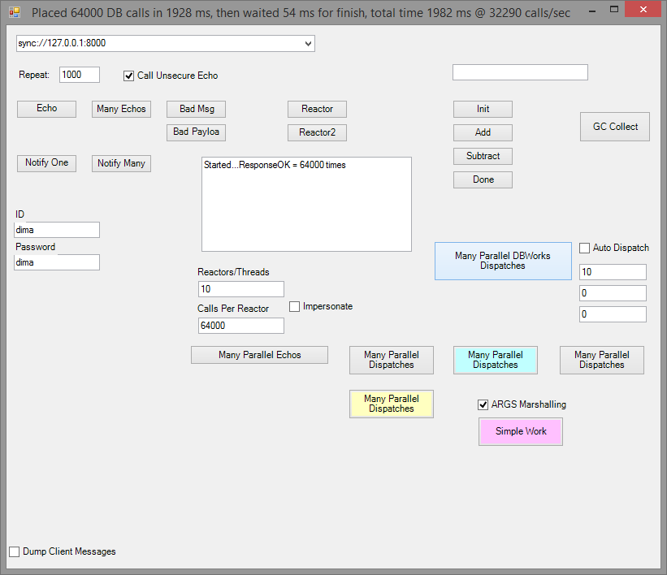
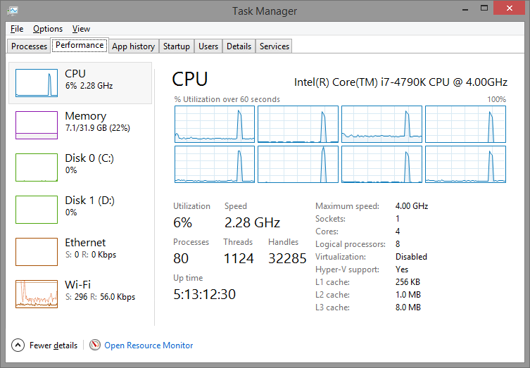
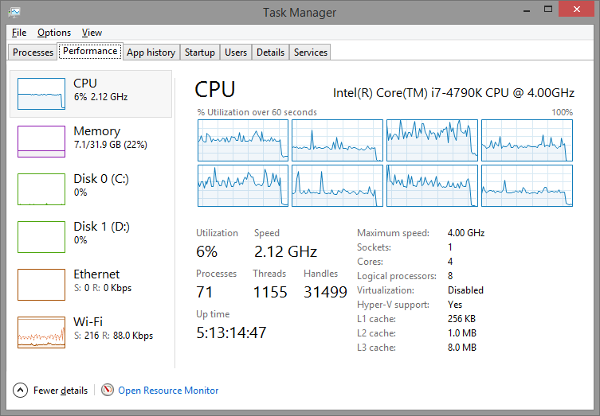
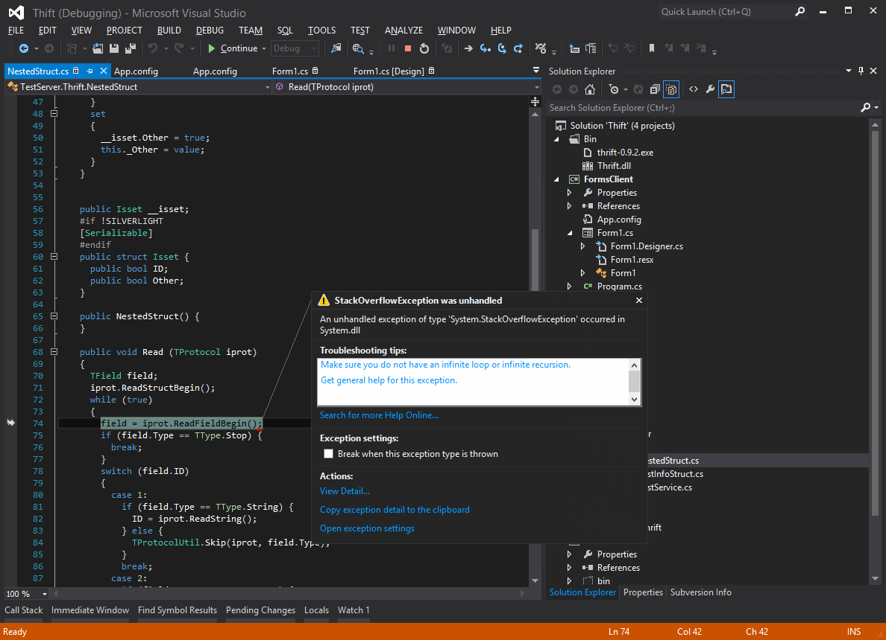

# Apache Thrift vs NFX.Glue Benchmark

## Why Compare?
I have blogged about GLUE [here](/archive/blog/2014/08/glue-interprocess-communication.html "NFX.Glue - Interprocess Communication"). Glue is the sole communication technology that we use in a cluster. It is very important to achieve the fastest results possible, yet still retain the feature-rich service that Glue provides (security, headers, exceptions, asynchrony etc..). Recently we have invested more time in optimizing the NFX.Serialization.SlimSerializer and NFX.Glue.Native.SyncBinding. The results that we achieved after optimization are very promising, but someone told me recently that we <a href="https://en.wikipedia.org/wiki/Apache_Thrift" target="_blank" title="Apache Thrift">can't compete with Facebook's Thrift</a>. Is this truly so? We had to test, so here goes...

## The Test
We have created the following Thrift Contract:
```thrift
  namespace csharp TestServer.Thrift
 
  struct NestedStruct
  {
   1: string ID
   2: NestedStruct Other
  }
 
  struct TestInfoStruct 
  {
   1: i64 ID
   2: string Name
   3: string DOB
   4: double Dbl
   5: bool Voter
   6: string Addr1
   7: string Addr2
   8: string AddrCity
   9: string AddrState
   10: string AddrZip
  }
 
  service TestService
  {
    TestInfoStruct GetTest()
    string Echo(1: string s)
    string SomeWork(1: i32 id, 2: string s, 3: bool b)
    list<testinfostruct> DBWork(1: i32 cnt)
    
    NestedStruct GetNested()  
  }
```

And here is the similar Glue counterpart in C#:
```cs
[Glued]
[AuthenticationSupport]
public interface IJokeContract
{
  ...................
  /// <summary>
  /// Emulates database work that returns dummy data and pauses for some interval emulating blocking backend access
  /// </summary>
  object DBWork(string id, int recCount, int waitMs);
  ...................
}
```
What we return in both cases is an array of "TestInfoStruct" filled with data like "Some_Person_"+i.ToString(). This emulates a typical "DB-like" work.  
For Glue we are using TPL on the client to apportion the work that needs to be done which is expressed as the number of calls.  
The Thrift test is also using TPL (tasks) to create X parallel workers, where X is entered on a test form.  
The machine is **4 core i7 gen 4..X at 4Ghz with 32Gb ram**.

Lets start by trying to return a dataset of 10 records, 10 fields each:
  
So this does: **64,000 calls at 32,000 ops/sec** each returning 10 rows.  

Here is the CPU spike:

Notice the pretty sharp CPU spike and pay attention to its width.

Now let's do the same test using Thrift. Here comes the client app:


So this does: **64,000 calls at 980 ops/sec** each returning 10 rows. WHAT? This is **30x times slower than Glue!** Is there anything wrong?  
Here is the CPU view for Thrift:

As you can see the CPU "spike" does not look like a spike, as it took around 65 seconds and could not even fit entirely in the CPU chart.  
A note about "64" threads. We experimented with 32 threads doing 2000 calls each, or 16 doing 4000 etc... it is all slower. 64 threads doing 1000 calls each was the most optimal case on that machine for this Thrift test.

## Results
After seeing these results we scratched our heads for a while. There got to be something stupid on our side? We did not use Thrift correctly? After doing some digging we found that BinaryProtocol is not the most efficient one in Thrift, so we re-ran with CompactProtocol. The results became better in Thrifts favor but still no very stellar.  
So the results are:
```
Each test is:
   64,000 calls each returning a set of 10 rows each having 10 fields
  640,000 total rows pumped
 
Glue:     took  1982 msec @ 32290 calls/sec
Thrift1:  took 65299 msec @   980 calls/sec  32x slower than Glue
Thrift2:  took 44925 msec @  1424 calls/sec  22x slower than Glue
=================================================================
Glue is:
   32 times faster than Thrift BinaryProtocol
   22 times faster than Thrift CompactProtocol
```
The subsequent re-runs of the test have yielded pretty much the same result +-10% variance. 
As far as parallelism, we tried different concurrency models with 4, 8, 16, 32, 64 and even 128 threads.
64 threads yielded the best results and the CPU load was pretty consistent. So why such performance disparity?

Here is what we got from Thrift-generated code when tried to pass a class with self-reference:


## Analyzing Results
Well, there are number of factors that make Thrift way slower than Glue. I will try to summarize here:
- **Thrift supports versioning**, the Glue binding that we tested against, does not.
Is it good/bad? for us its good because SYNC Glue binding is designed to inter-communicate between processes built against the same lib version.
No versioning is needed. Slim serializer that Glue SYNC binding is based on, omits writing field order and types into the stream as the class blue-print 
in memory always matches (if it does not then you cant connect)
- **Thrift is cross-language**, which means that Thrift does not support types like DateTime, GUID, and 10s of others that SYNC Glue binding natively supports on the CLR level.
This definitely makes transmission of things like DateTime way slower
- **Thrift does not support cyclical graphs**, at least we could not serialize an object with reference to self.Is this needed?
It may be if one needs to push trees of graphs of complex data. SYNC Glue binding does not have this limitation

## Conclusion
Thrift is definitely a way lower-level RPC framework than Glue. Glue is much higher level framework that supports: channel throttling, declarative configurations, message inspectors, logging, dumping of messages, external control (setting parameters at runtime), instrumentation statistics, declarative security and async messaging model.  
Thrift does not have these features in its scope as it is just an RPC channel handler.  
As far as performance is concerned, Thrift is slower at least 20 times for passing non-primitive data than native Glue bindings because Thrift emits extra data into stream and does other conversions that are not necessary in case of native Glue stack.  
Is it possible to create a cross-language binding in Glue? Absolutely it is, and the performance will probably be somewhere around Thrift, however the benefit of Unistack approach is to not use 10 different languages/libs in the same system, hence native glue is all we need for internal cluster programming.

P.S> I just realized that we did not build our test Glue rig with [X]Optimize Code checked. So our results stated in the blog are like 15-20% worse than what they could have been. In other words NFX.Glue is like 15% faster than this post describes if it is built in release config. I also forgot to capture wire message sizes which I'll do later. The speed test is enough for me.

---
Dmitriy Khmaladze  
March 18, 2015