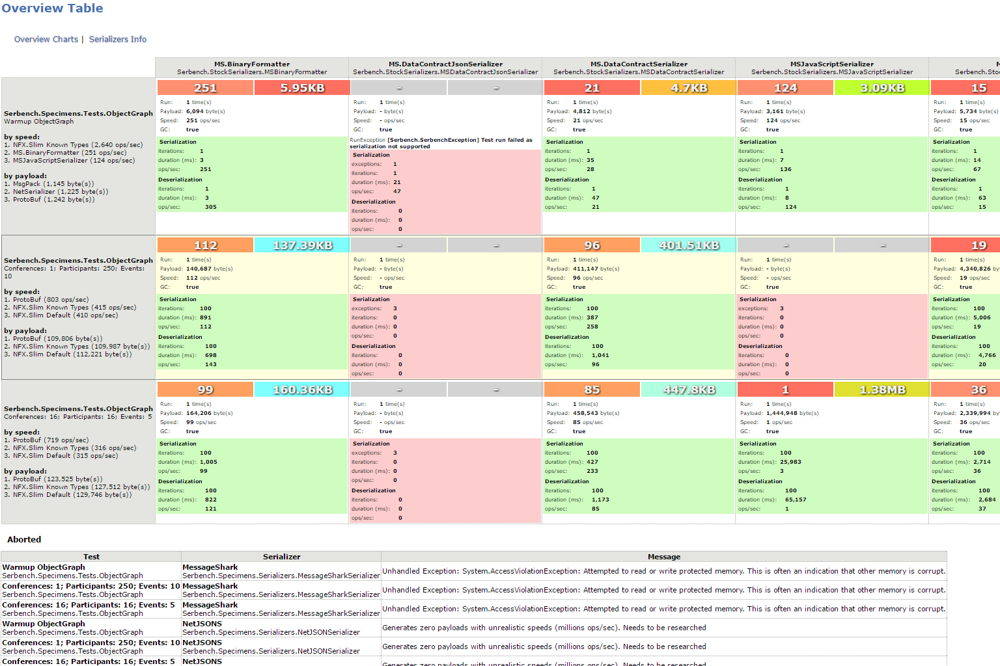
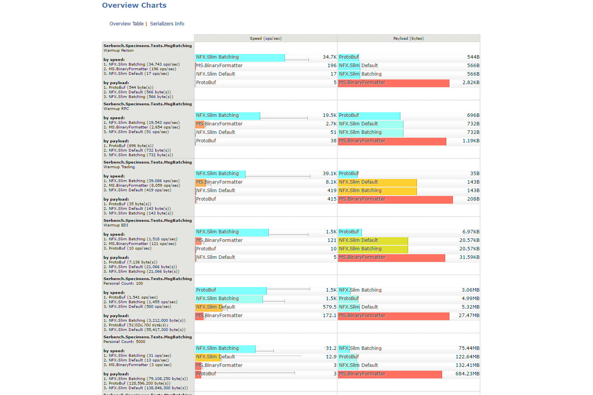

# Serializer Benchmarking Suite

The purpose of this tool is to test the performance/capabilities of various serializers available for the CLR/.NET platform.

Serbench is based on **NFX** Application Model, therefore it supports many configurable/pluggable features right out of the box:

* Logging with various destinations (console, file, db etc.)
* Test data output into DataStore (i.e. store data is RDBMS, CSV, JSON, etc.)
* Visualize test data via an HTML/Web application (generated by the tool)

Both tests and serializers are descendants of corresponding base classes which can be injected via a named config into the tool. 
This approach allows for high degree of flexibility as everything is configurable.

Every test determines what payload kind/type, pattern and size is used against every serializer, 
so the tool permutes all test instances and serializer instances to test different combinations.

The dynamic/injectable nature of Serbench allows for coverage of many non-trivial use cases like parallel serialization, stateful client/server channels. 
These kind of tests are usually overlooked/not considered by testers.

Not all serializers support all features, i.e. JSON may not support cyclical object graphs. 
This is normal and actually is expected to be discovered by this tool.

Serbench **does not give any preference to any particular serializer**. 
Any serializer may be abstracted and tested against the tests that are already established and executed against others.

Serbench uses Stream as an output target. 
This is because ultimately ALL serializers must produce a stream of bytes because devices (sockets, disks) are block/byte based, not string based. 
Keep in mind that while your favorite serializer may return a JSON string, it can not be sent (String object) over the wire as-is, an encoded string can, 
hence we are concerned with the "physicality" of the sent data. We assume that the serializers of interest would be needed for saving data to storage / network communication. 
Any mature serializer must provide a way to output information (even if it is in a textual format, like JSON or XML) into a stream of bytes, without making extra buffer copies.

The results of Serbench tool are available at the <a href="http://aumcode.github.io/serbench" target="_target">link</a>

 

 

